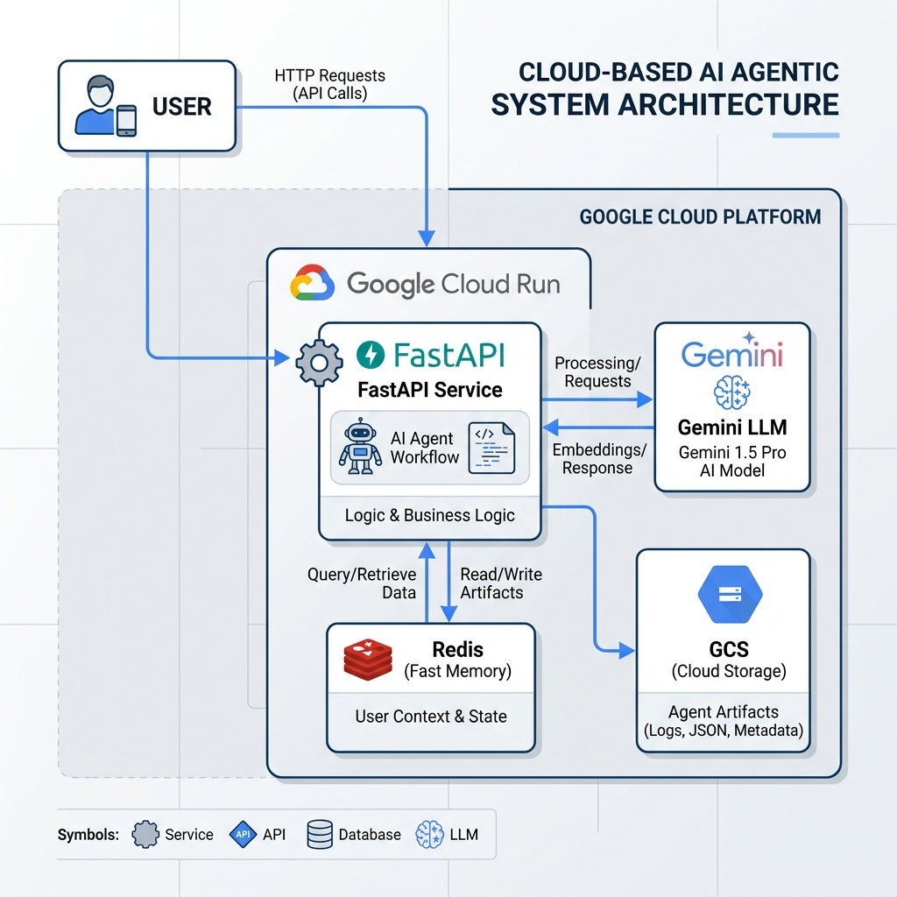

# Vague Descriptions Checker

An AI-powered service that classifies cargo descriptions as **CLEAR** or **VAGUE** based on official U.S. Customs and Border Protection (CBP) guidelines.

## Overview

The `vague_descriptions_checker` is a specialized agentic service built with **Google ADK (Agent Development Kit)** and **FastAPI**. It leverages **Gemini 2.5 Flash** to provide structured classifications of cargo descriptions, helping logistics and trade compliance teams ensure accuracy and regulatory compliance.

### Key Features

-   **Structured Classification**: Returns high-fidelity JSON responses indicating if a description is `CLEAR` or `VAGUE`.
-   **Grounded Reasoning**: Provides detailed explanations for every classification, grounded in official CBP guidelines.
-   **Resilient Tooling**: Dynamically fetches CBP guidelines with a built-in Google Cloud Storage (GCS) fallback and cache.
-   **Low-Latency Caching**: Uses **Redis** to cache common descriptions and their classifications, reducing LLM costs and improving response times.
-   **Production Ready**: Includes comprehensive logging, Cloud Tracing (OpenTelemetry), and health checks.
-   **Automated Infrastructure**: Uses **Terraform** for full environment provisioning on Google Cloud (Cloud Run, VPC, Redis, GCS).

---

## High-Level Architecture

The system follows a modular, agentic architecture designed for reliability and scalability.

### Visual Architecture


## Project Structure

-   `app.py`: FastAPI entry point with ADK integration.
-   `vague_descriptions_checker/`: Main agent package.
    -   `agent.py`: Agent definition and orchestration logic.
    -   `utils/`: Core utilities for logging, prompting, web fetching, and caching.
-   `terraform/`: Infrastructure-as-code for GCP deployment.
-   `tests/`: Comprehensive test suite for agent logic and tooling.
-   `requirements.txt`: Python dependencies.
-   `test_data.jsonl`: Test dataset containing cargo descriptions and their ground truth labels.
-   `metrics_calc.py`: Evaluation script to calculate accuracy, precision, and latency metrics for the agent.

---

## Getting Started

### Prerequisites

-   Python 3.12
-   Google Cloud Project (for Gemini API, Redis, and GCS)
-   `.env` file with necessary credentials (see `.env.example` if available)

### Installation

```bash
pip install -r requirements.txt
```

### Running Locally

```bash
python app.py
```
The API will be available at `http://localhost:8080`. You can access the interactive documentation at `http://localhost:8080/docs`.

### Testing

```bash
pytest
```

### Evaluation & Metrics

The project includes a metrics calculation script to evaluate the agent's performance against a known dataset.

**Test Data**: `test_data.jsonl` contains a set of cargo descriptions with "clear" or "vague" labels used as ground truth.

**Run Evaluation**:
To calculate Accuracy, Precision, and Latency:
```bash
# Ensure you are in the conda environment
conda activate vague_cargo
python metrics_calc.py
```

The script will output:
- **Accuracy**: Overall classification correctness.
- **Precision**: Calculated for both `clear` and `vague` classes.
- **Latency**: Average, min, max, and median execution times.

---

## Infrastructure Provisioning

This project uses **Terraform** to manage and deploy resources across two Google Cloud projects: one for `dev` and one for `prod`.

### Prerequisites

- **Terraform 1.5+** installed locally.
- **Gcloud CLI** authenticated with `gcloud auth application-default login`.
- **Permissions**: Ownership or Editor access to both the development and production GCP projects.

### Configuration (Crucial)

Before deploying, you must specify your Google Cloud Project IDs. 

> [!IMPORTANT]
> **Where to add Project IDs:**
> 1. **`terraform/terraform.tfvars`**: Create this file (if not present) and define your IDs:
>    ```hcl
>    dev_project_id  = "your-dev-project-id"
>    prod_project_id = "your-prod-project-id"
>    ```
> 2. **`dev_deployment/dev_deploy.sh`**: Update the `PROJECT_ID` variable on line 18 for local build and deployment testing.

### Deployment Workflow

Navigate to the `terraform/` directory and execute the following:

```bash
# 1. Initialize the backend and providers
terraform init

# 2. Preview the resources being created
terraform plan

# 3. Provision the infrastructure
terraform apply
```

---

## Resource Deep Dive

The Terraform modules provision identical, isolated stacks in both environments. Here is a breakdown of the core resources:

### 1. Networking Stack
- **VPC Network**: A custom VPC named `default` is created for secure internal communication.
- **Firewall Rules**:
    - `allow-all-internal-ingress`: Permits inter-service communication within the VPC.
    - `allow-redis-egress`: Strictly controls traffic to the Cloud Redis instance on port 6379.
- **Private Service Access**: Configured via VPC Peering to allow Cloud Run to communicate with internal Google services (like Redis) without exposing them to the public internet.
- **VPC Access Connector**: A bridge named `vpc-conn` that enables serverless Cloud Run services to access VPC resources with low latency.

### 2. Data & Storage
- **Cloud Redis (MemoryStore)**: An instance named `firstone` acts as the high-speed caching layer. It stores previous Gemini classifications to reduce costs and response times.
- **Google Cloud Storage (GCS)**: A bucket named `rxo-rate-card-[PROJECT_ID]` stores the cached CBP guidelines, providing a resilient fallback for the agent's web-fetching tool.

### 3. Intelligence & API
- **Google GenAI API**: Enabled to provide the agent with access to **Gemini 2.5 Flash**.
- **Cloud Run**: Deployment targets for scaling the FastAPI application (standardized in `app.py`).

---

## CI/CD Setup (GitHub Actions)

The `dev_deployment/ci_cd.sh` script provides an automated way to bootstrap your Google Cloud environment for secure, keyless authentication from GitHub Actions using **Workload Identity Federation (WIF)**.

### What `ci_cd.sh` Provisions:
- **Workload Identity Pool**: Creates a global pool for OIDC authentication.
- **WIF Provider**: Configures GitHub as a trusted identity provider, scoped to your repository (default: `KVishnuVardhanR/sample-test`).
- **Service Account (`github-deployer`)**: A specialized account that GitHub "impersonates" to perform deployments.
- **KMS Key Management**: Sets up a keyring and symmetric keys to encrypt containers in the Artifact Registry.
- **IAM Policies**: Automatically binds the necessary roles (`run.admin`, `artifactregistry.writer`, `cloudbuild.builds.editor`) to the deployer account.

### Configuring for Your Organization:
To use this with your specific repository, update the following variables and lines in `ci_cd.sh` before running it for **both** dev and prod projects:
- **Project IDs**: Update the `--project` flag on lines 9, 18, 25, 84, and 92.
- **Repository Scope**: Update the `--attribute-condition` (line 63) and member binding (line 73) with your repository path: `assertion.repository == 'ORG/REPO_NAME'`.

---

## Branch Protection Rules

To maintain high code quality and prevent accidental production breakage, it is recommended to set up the following branch protection rules in GitHub:

### `main` (Production)
- **Require a pull request before merging**.
- **Require approvals**: At least 1 review from a project owner.
- **Require status checks to pass**: `pytest` and successful build on a feature/develop branch.
- **Restrict deletions**: Prevent accidental branch deletion.

### `develop` (Staging/Dev)
- **Require a pull request before merging**.
- **Automated Deployments**: Configure GitHub Actions to trigger `dev_deploy.sh` automatically upon a successful merge to this branch.

---

## Deployment & Canary Strategy

This project implements a **Canary Release (Blue/Green)** strategy to ensure safe deployments without immediate user impact.

### How it Works:
1. **Green Deployment**: The `dev_deploy.sh` script deploys a new revision with the tag `green`.
2. **0% Initial Traffic**: The `--no-traffic` flag ensures that the new version is live but receives no production traffic.
3. **Internal Validation**: Developers can test the new revision via the specific tagged URL (e.g., `https://green---vague-descriptions-checker...`).
4. **Promotion**: Once validated, traffic is shifted to the new revision (100% or incremental) via a `gcloud run services update-traffic` command.

### Environment Workflow:
-   **Development**: Pushes to `develop` trigger an immediate canary deployment to the Dev project.
-   **Production**: Merges to `main` (via PR from `develop`) trigger a canary deployment to the Prod project, requiring manual "promotion" to 100% traffic after validation.

---

## API Documentation

-   **POST `/vague_descriptions_checker/run`**: Primary endpoint to run the agent.
-   **GET `/health`**: Liveness probe for deployment.

For full schema details, visit the `/docs` endpoint or refer to `openapi.json`.
